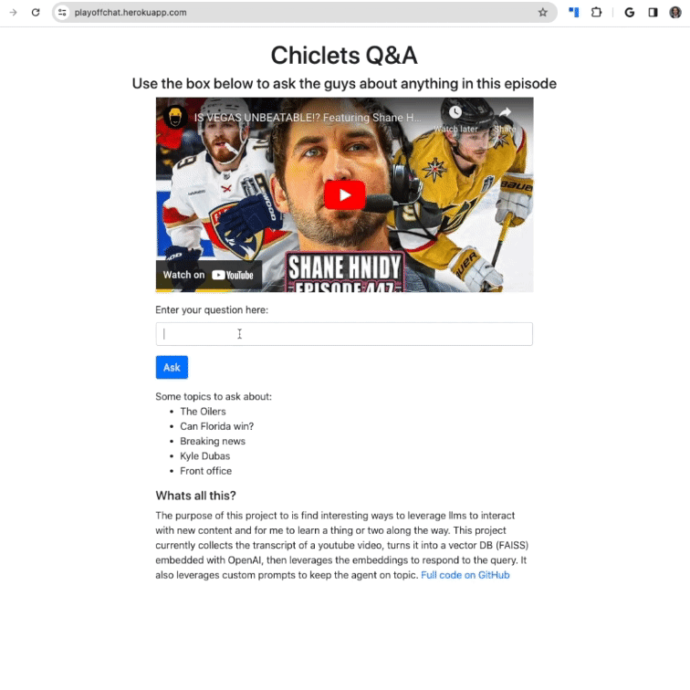

# Learning LangChain basics by building a video Q&A system

My objective for this project was to learn my way around LangChain by building a fun full stack project. Since the NHL playoffs are going on and I really enjoy the commentary by the guys on the Spittin Chiclets podcast, but rarely get to listen to all three hours, I thought a site that allowed me to get information from the content without watching/listening to the entire thing would be useful.

<a href='https://playoffchat.herokuapp.com/'>Live site</a>

The core steps to accomplish this are to:
<ol>
 <li>Get the podcast transcript from Youtube using Langchain's built in Youtube document loader <a href='https://github.com/shibby576/chiclet/blob/main/data_processing.py'>Video processing code</a> </li>
 <li>Split the text from the transcript into chunks using LangChain's recursive text splitter and create a collection of documents</li>
 <li>Save these documents into a vector index, I used FAISS and did it in cpu to keep things simple.</li>
 <li>This index is created each time the application is started, which is not ideal but good enough for my small use case</li>
 <li>To query this content, I used LangChain's LLMChain with both system and human prompt templates. This allowed me to give the LLM context about the video and guard rails on how to respond <a href='https://github.com/shibby576/chiclet/blob/main/query.py'>Query code</a> </li>
 <li>On submit a few things happen. First a similarity search is run against the vector DB to find the most relevant chunks of content. Then the chain object is created, which consists of the LLM (GPT 3.5) and the prompt templates. Lastly the chain runs with the question the user asked and the document segments as the inputs</li>
 <li>The response is returned, formatted, and sent back to the front end <a href='https://github.com/shibby576/chiclet/blob/main/app.py'>Main app code </a>| <a href='https://github.com/shibby576/chiclet/blob/main/templates/index.html'>Front end</a></li>
</ol>

While the response time is a little slow, I found that the retrieval worked pretty well and that the responses seem to stay on task even when prompted otherwise (try asking about something random).

For users who are unfamiliar with hockey, i wanted to create an easy way to get a summary that would give users an idea of what topics are covered in the podcast and thus things to ask. I was able to implement this using LangChains map reduce summarize chain, which helps accommodate for large token sets, then turned the response to an html list before returning it to the front end. Code can be found in the <a href='https://github.com/shibby576/chiclet/blob/main/summary.py'>summary.py </a> file with a variety of other changes throughout the app. While this worked, it ended up costing $3-$5 for each summary, so its been disabled for now. 

Overall this was a really fun project. It makes me wonder if we'll see content creators adding an interactive system like this on top of their content for an "AMA" style interaction any time. 
